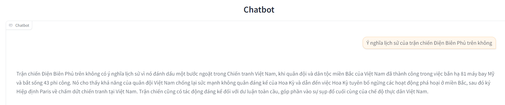
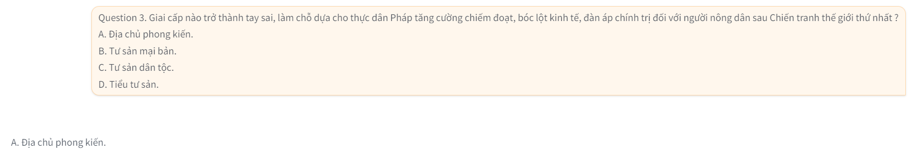
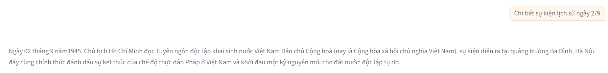
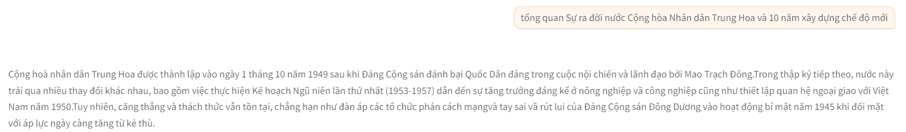
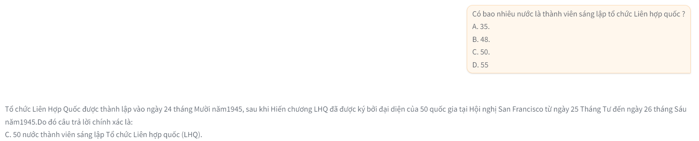
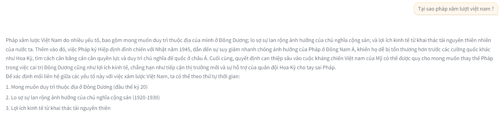

# Chatbot RAG with LLM VietNamese use Ctransformers, Langchain, MongoDB
___
## Environment variables:
```
HUGGINGFACE_TOKEN = ''
MONGODB_ATLAS_CLUSTER_URI = ''
MODEL_FILE_PATH = './models/.gguf'
MODEL_EMBEDDING_NAME = ''
VECTOR_DB_PATH = './db'
STORE_CACHE_PATH = './cache'
DB_NAME = ''
COLLECTION_NAME = ''
ATLAS_VECTOR_SEARCH_INDEX_NAME = ''
```
___
## How to run:
1. Install library:`pip install -r requirements.txt`
2. Download file model `.gguf` to path: `models/`
3. Run cmd: `python app.py`
4. Model will running on local URL:  http://127.0.0.1:7860

*Note: You can upload file .pdf to `documents/` and run vector_db.py for custom data.*
___
## Models:
- Embedding: 
    <!-- - [all-MiniLM-L6-v2-f16](https://huggingface.co/caliex/all-MiniLM-L6-v2-f16.gguf) -->
    - [bkai-foundation-models/vietnamese-bi-encoder](https://huggingface.co/bkai-foundation-models/vietnamese-bi-encoder)
- LLMs: 
    - [Vistral-7B-Chat](https://huggingface.co/uonlp/Vistral-7B-Chat-gguf)
    - [VinaLLaMA](https://huggingface.co/vilm/vinallama-2.7b-chat-GGUF)
___

## Demo
<!--  -->

<br>

<br>

<br>

<br>

___
